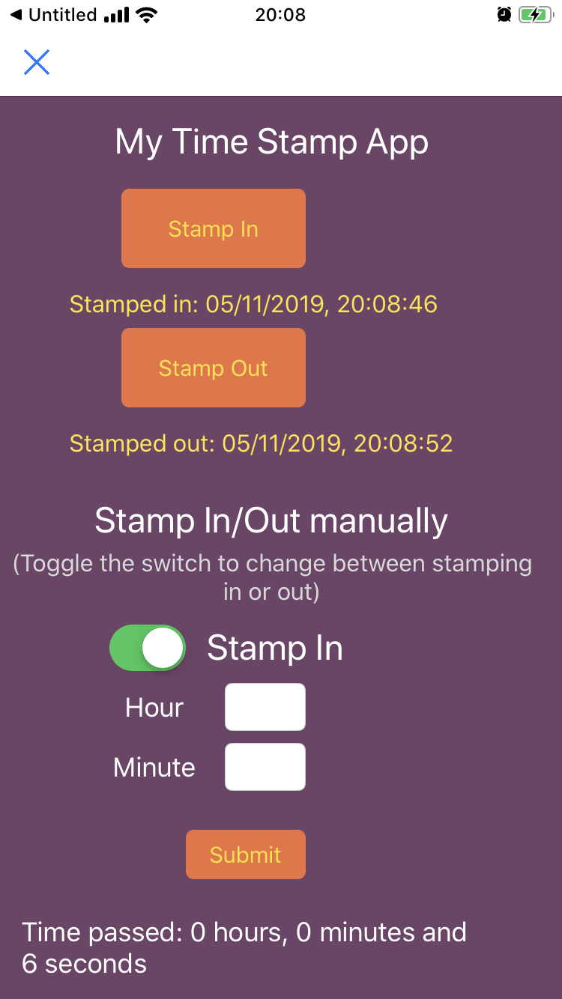
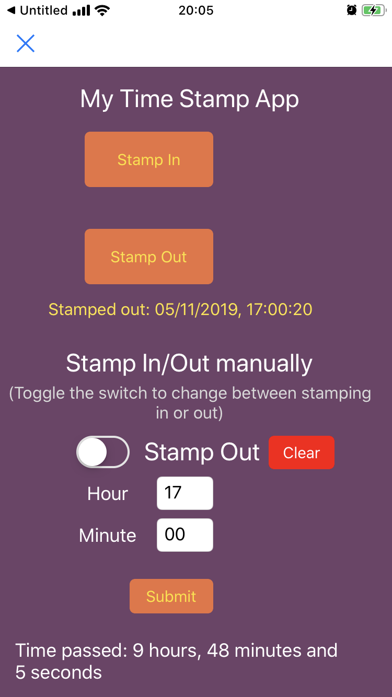

# TimeStamp
A simple timestamp app, made with Python. It writes the timestamps to a JSON-file.  
One version of the app is made with Tkinter, available on both Windows and Mac. 

There's also a version available for Pythonista on IOS. 

### Screenshots of the Pythonista version used on an iPhone 7

This version of GUI requires the app Pythonista to run. 

It's possible to log in or out manually. However, this is restricted to the same work day. 
